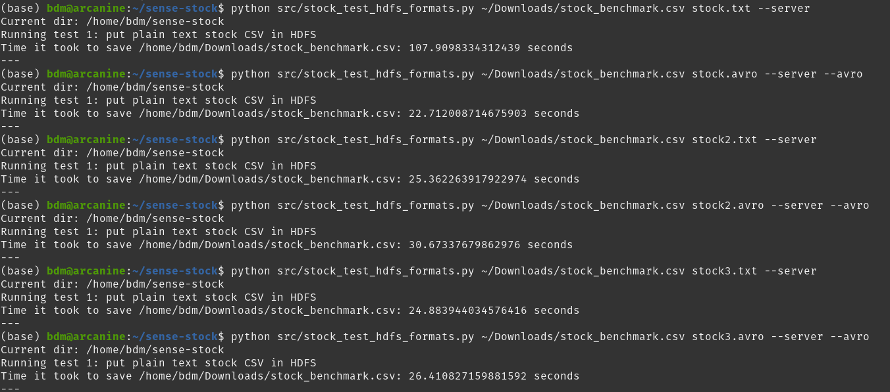

# sense-stock
This is a project for BDMA 2nd Semester at UPC, Barcelona.

### Setup Instructions
Create a log folder
```bash
mkdir logs
```
Use the script to [connect to VPN](docs/connect_vpn.sh)

Create the required directory on Hadoop HDFS
```bash
hdfs dfs -ls /user/bdm/stock
```

### Cronjobs
For local setup: Cronjob command to run the `fetch_ohlc_data.py` at 5th minute of every hour. It basically executes the
file `run.sh` which has the full command with arguments.

    5 */1 * * * /home/teemo/MEGA/bdma-semesters/2-semester/sense-stock/run.sh

For upc-vm setup: Cronjob command to run the `fetch_ohlc_data.py` at 5th minute of every hour. It basically executes the
file `run_server.sh` which has the full command with arguments.

    0 23 * * * /home/teemo/MEGA/bdma-semesters/2-semester/sense-stock/run_server.sh

#### Once per night, copy files from local directory to HDFS
For upc-vm setup: Cronjob command to run the `stock_raw_to_hdfs` at 23:00.

    5 */1 * * * /home/teemo/MEGA/bdma-semesters/2-semester/sense-stock/run_persistent_landing.sh


### Instructions to Benchmark different file formats on HDFS
Usage is explained in the file `stock_test_hdfs_formats.py`. Examples are also given.

Example of output:


### HDFS
#### HDFS Config
Following is the default file and location of the config file. 
` ~/.hdfscli.cfg`

### List of companies
List of companies for which we are working

| Symbol | Company Name           |
|-------|------------------------|
| ATVI  | Activision Blizzard    |
| ADBE  | Adobe                  |
| GOOGL | Alphabet               |
| AMZN	 | Amazon                 |
| AMD 	 | AMD                    |
| AAPL  | Apple                  |
| CMG   | Chipotle Mexican Grill |
| CSCO  | Cisco                  |
| DIS 	 | Disney                 |
| DPZ 	 | Domino's               |
| INTC	 | Intel                  |
| FB    | Meta                   |
| MCHP  | Microchip              |
| NFLX  | Netflix                |
| NKE   | Nike                   |
| TSLA  | Tesla                  |

## Resources
If you want to put files on server using command line from python
https://stackoverflow.com/questions/26606128/how-to-save-a-file-in-hadoop-with-python
